# Architecture Overview

This document explains the architecture and design decisions for the D365 Integration Samples.

## 🏗️ High-Level Architecture

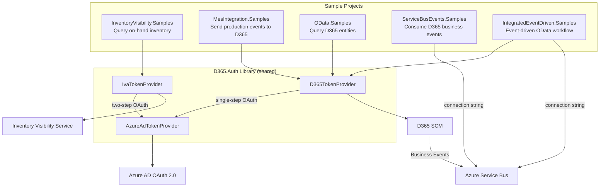

## 🔐 Authentication Architecture

### Shared Authentication Library (D365.Auth)

The `D365.Auth` library provides three token providers:

1. **AzureAdTokenProvider** (Base)
   - Acquires Azure AD OAuth 2.0 tokens using the client credentials flow
   - Thread-safe token caching via `SemaphoreSlim` — prevents thundering-herd token requests
   - Cached tokens are reused until they are within 5 minutes of expiration

2. **IvaTokenProvider** (Inventory Visibility)
   - Two-step authentication:
     - Step 1: Get an Azure AD token with the hardcoded IVA service scope (`0cdb527f-a8d1-4bf8-9436-b352c68682b2/.default`)
     - Step 2: POST that token to the IVA security service to exchange for an IVA-specific access token
   - Handles HTTP 307 redirects from the security service automatically

3. **D365TokenProvider** (Standard APIs)
   - Single-step: uses the Azure AD token directly for all D365 OData and message service calls
   - **Scope is derived dynamically at runtime** from the configured `BaseUrl` (`{scheme}://{host}/.default`) — there is no hardcoded tenant or instance URL

> **Note**: `ServiceBusEvents.Samples` does **not** use `D365.Auth`. It connects to Azure Service Bus
> via a connection string only — no Azure AD auth is involved.

### Token Provider Comparison

| Provider | Auth Steps | Scope | Used By |
|----------|-----------|-------|---------|
| AzureAdTokenProvider | 1 (base) | Configurable | IvaTokenProvider, D365TokenProvider |
| IvaTokenProvider | 2 (AD + IVA exchange) | Hardcoded IVA GUID → IVA token | InventoryVisibility.Samples |
| D365TokenProvider | 1 | Derived from `BaseUrl` at runtime | MesIntegration, OData, IntegratedEventDriven |

## 📦 Project Structure

### Source Projects

```
src/
└── D365.Auth/
    ├── Models/
    │   ├── AuthModels.cs        # Public configuration models
    │   └── InternalModels.cs    # Internal token response models
    └── Providers/
        ├── AzureAdTokenProvider.cs
        ├── IvaTokenProvider.cs
        └── D365TokenProvider.cs
```

### Sample Projects

```
samples/
├── InventoryVisibility.Samples/
│   ├── Models/
│   │   └── IvaModels.cs         # IVA request/response models
│   ├── Services/
│   │   └── IvaService.cs        # IVA API client (with partition retry logic)
│   ├── Program.cs               # Sample scenarios
│   └── README.md
├── MesIntegration.Samples/
│   ├── Models/
│   │   └── MesModels.cs         # MES message models
│   ├── Services/
│   │   ├── MesService.cs        # Async message queue client (SysMessageServices)
│   │   └── MovementWorkService.cs  # Synchronous warehouse movement (TSIMesWebServices)
│   ├── sample-data.json         # Sample payload data
│   ├── Program.cs               # Production lifecycle samples
│   └── README.md
├── OData.Samples/
│   ├── Models/
│   │   └── ODataModels.cs       # D365 entity models
│   ├── Services/
│   │   └── ODataService.cs      # OData query client
│   ├── sample-queries.json      # Sample OData filter expressions
│   ├── Program.cs               # Query examples
│   └── README.md
├── ServiceBusEvents.Samples/
│   ├── Models/
│   │   └── BusinessEventModels.cs  # D365 event envelope + D365DateTimeConverter
│   ├── Services/
│   │   └── ServiceBusConsumerService.cs  # PeekLock consumer with DLQ support
│   ├── Program.cs               # Poll-once, continuous, or DLQ inspection modes
│   └── README.md
└── IntegratedEventDriven.Samples/
    ├── Models/
    │   └── IntegratedModels.cs  # Combined event + OData models
    ├── Services/
    │   └── IntegratedService.cs  # Creates own ServiceBusClient + D365 OData calls
    ├── Program.cs               # Integrated event-driven workflow
    └── README.md
```

## 🔄 Request Flows

### Inventory Visibility

```mermaid
sequenceDiagram
    participant App as MES Application
    participant Svc as IvaService
    participant TP as IvaTokenProvider
    participant AAD as Azure AD
    participant Sec as IVA Security Service
    participant API as Inventory Visibility API

    App->>Svc: QueryOnHandAsync(request)
    Svc->>TP: GetIvaTokenAsync()
    TP->>AAD: POST /token (scope: 0cdb527f-.../.default)
    AAD-->>TP: Azure AD access token
    TP->>Sec: POST /security/dataservice/authenticatebytoken
    Sec-->>TP: IVA access token
    TP-->>Svc: IVA access token
    Svc->>API: POST /api/environment/{EnvironmentId}/onhand/indexquery
    alt 200 OK
        API-->>Svc: On-hand balances (JSON)
        Svc-->>App: List&lt;OnHandQueryResponse&gt;
    else 500 "Waiting for partition" (cold-start)
        API-->>Svc: 500 error
        Note over Svc: Retry with exponential backoff — 5 s, 10 s, 20 s (up to 3 attempts)
        Svc->>API: Retry POST
        API-->>Svc: On-hand balances
        Svc-->>App: List&lt;OnHandQueryResponse&gt;
    end
```

> **`EnvironmentId` is a URL path segment**, not a query parameter. The full endpoint is
> `{ServiceUrl}/api/environment/{EnvironmentId}/onhand/indexquery`.
>
> **Cold-start retries**: IVA returns HTTP 500 with `"Waiting for partition"` in the body when its
> internal partition is warming up. `IvaService` retries up to three times with exponential backoff
> before propagating the error.

### MES Integration — Async Queue (SysMessageServices)

All production lifecycle events (start, RAF, picking list, end, count journal, batch disposition) are
sent through D365's asynchronous message queue. D365 processes these via a batch job — the caller
gets no immediate business-level confirmation.

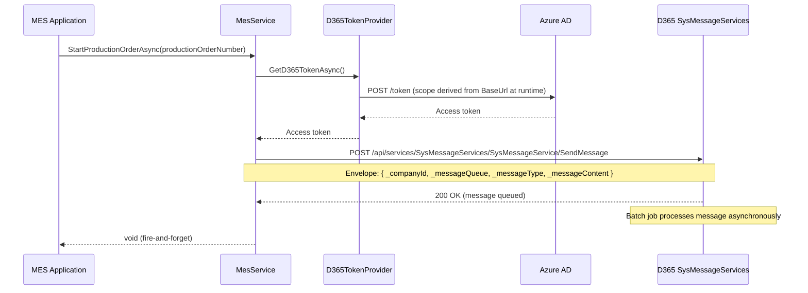

**Message envelope** — every async call wraps the business payload in this structure:

| Field | Description |
|-------|-------------|
| `_companyId` | D365 legal entity (e.g. `"USMF"`) |
| `_messageQueue` | Target queue name |
| `_messageType` | Message type identifier (see table below) |
| `_messageContent` | JSON-serialised business payload |

**Supported message types**:

| `_messageType` | `MesService` method |
|---|---|
| `ProdProductionOrderStart` | `StartProductionOrderAsync` |
| `ProdProductionOrderReportFinished` | `ReportAsFinishedAsync` |
| `ProdProductionOrderPickingList` | `PostPickingListAsync` |
| `ProdProductionOrderEnd` | `EndProductionOrderAsync` |
| `TSIInventCountJournal` | `PostInventCountJournalAsync` |
| `TSIUpdateBatchDisposition` | `UpdateBatchDispositionAsync` |

### MES Integration — Synchronous (TSIMesWebServices)

Warehouse movement work (physical stock relocation) is sent via a **synchronous** endpoint that
returns an immediate confirmation. Unlike the async queue, the caller knows straight away whether
D365 accepted the request.

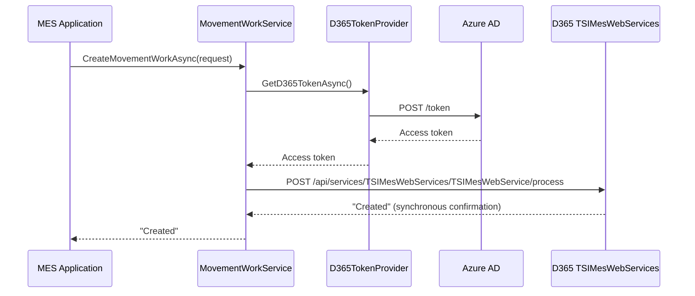

### OData Query

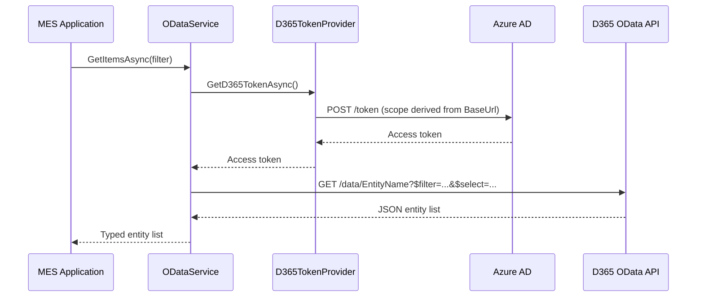

### Service Bus Event Consumption

`ServiceBusEvents.Samples` (and `IntegratedEventDriven.Samples`) receive D365 business events via
Azure Service Bus. Authentication is **connection-string based** — `D365.Auth` is not involved.

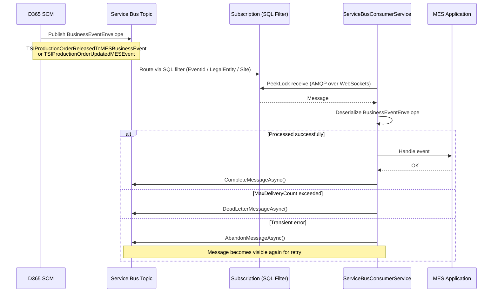

> **`IntegratedEventDriven.Samples`** creates its own `ServiceBusClient` directly inside
> `IntegratedService` — it does not reuse `ServiceBusConsumerService` from the `ServiceBusEvents`
> project.

## 🎯 Design Patterns

### 1. Dependency Injection

All services use constructor injection:

```csharp
public class IvaService
{
    private readonly HttpClient _httpClient;
    private readonly IvaTokenProvider _tokenProvider;
    private readonly ILogger<IvaService> _logger;

    public IvaService(
        HttpClient httpClient,
        IvaTokenProvider tokenProvider,
        ILogger<IvaService> logger)
    {
        // ...
    }
}
```

**Benefits**:
- Testability (mock dependencies)
- Loose coupling
- Configuration flexibility

### 2. Token Caching with Thread Safety

```csharp
private TokenResponse? _cachedToken;
private readonly SemaphoreSlim _lock = new(1, 1);

public async Task<string> GetTokenAsync()
{
    await _lock.WaitAsync();
    try
    {
        if (_cachedToken != null && !_cachedToken.IsExpired)
            return _cachedToken.AccessToken;

        // Acquire new token
    }
    finally
    {
        _lock.Release();
    }
}
```

**Benefits**:
- Prevents multiple simultaneous token requests
- Reduces API calls
- Improves performance

### 3. Configuration as Code

```csharp
services
    .AddSingleton(configuration.GetSection("AzureAd").Get<AzureAdConfig>()!)
    .AddScoped<AzureAdTokenProvider>()
    .AddScoped<IvaTokenProvider>();
```

**Benefits**:
- Type-safe configuration
- Easy to test
- Clear dependencies

### 4. Service Layer Pattern

Each API has a dedicated service:
- `IvaService` - Inventory Visibility on-hand queries
- `MesService` - Async MES message queue (SysMessageServices)
- `MovementWorkService` - Synchronous warehouse movement (TSIMesWebServices)
- `ODataService` - D365 entity queries

**Benefits**:
- Single responsibility
- Reusable across applications
- Easy to extend

## 🔧 Technology Stack

| Component | Technology | Version |
|-----------|-----------|---------|
| Language | C# | Latest |
| Framework | .NET | 8.0 |
| HTTP Client | HttpClient | Built-in |
| JSON | System.Text.Json | 8.0 |
| DI Container | Microsoft.Extensions.DependencyInjection | 8.0 |
| Logging | Microsoft.Extensions.Logging | 8.0 |
| Configuration | Microsoft.Extensions.Configuration | 8.0 |
| Service Bus | Azure.Messaging.ServiceBus | Latest |

## 📊 Data Flow

### Outbound (MES → D365)

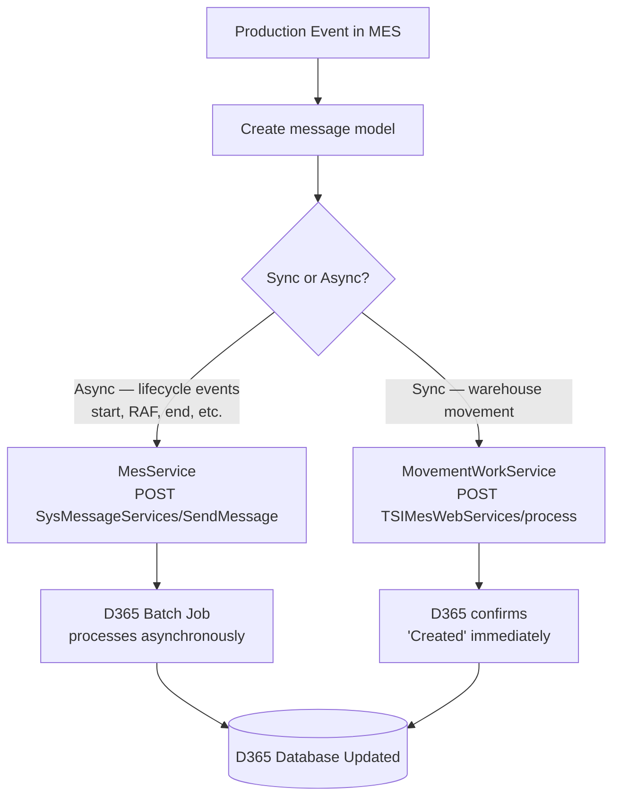

### Inbound (D365 → MES)

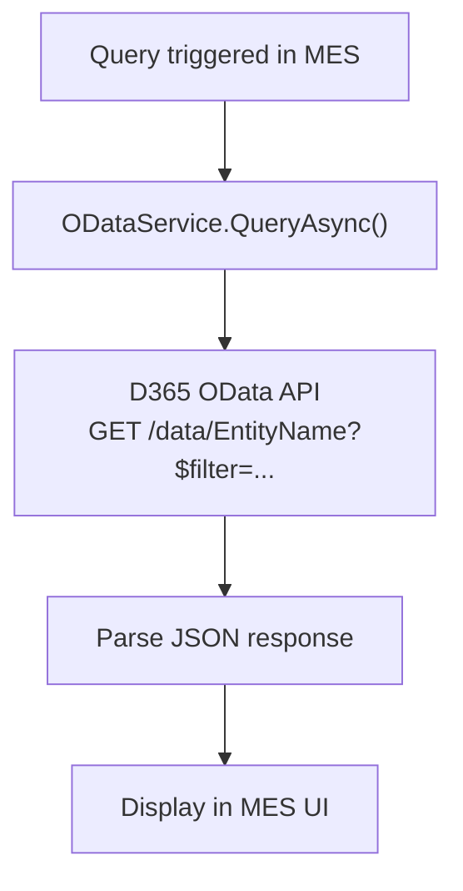

### Inventory Visibility (Read-Only)

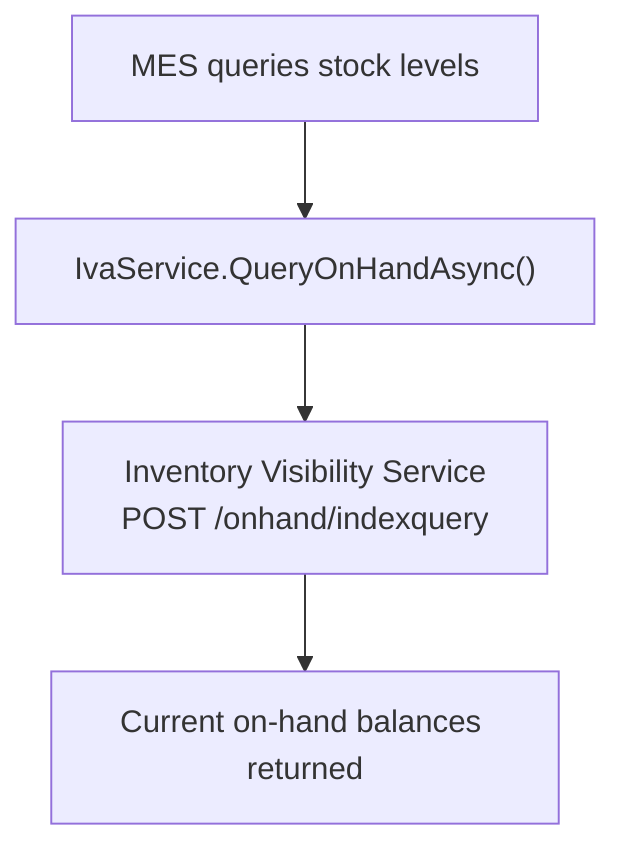

> The Inventory Visibility Add-in is used **read-only** by the MES. On-hand balances are queried for
> production planning reference. Inventory movements are recorded in D365 via the MES Integration
> message API (material consumption / report as finished), not posted directly to IVA.

### Event-Driven (Service Bus)

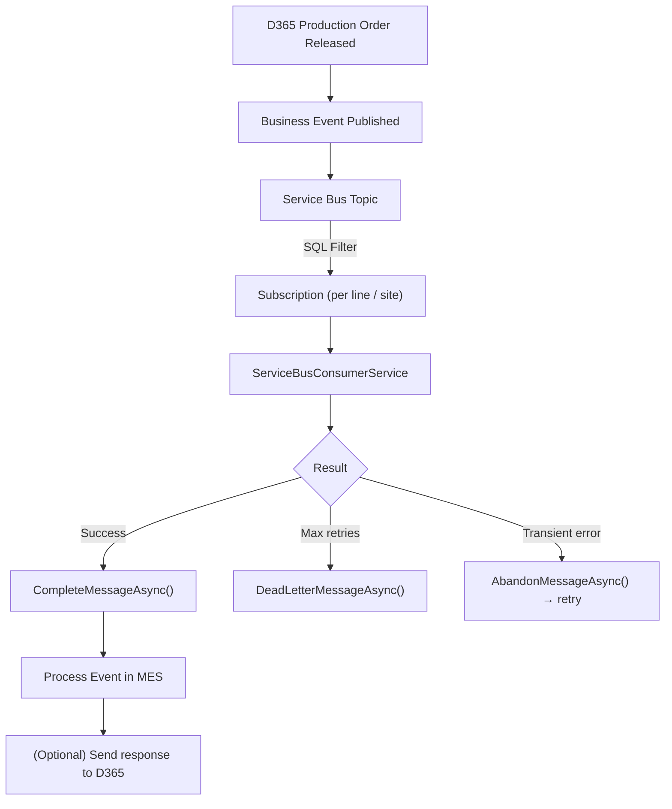

## 🔒 Security Considerations

### 1. Secrets Management
- Client secrets stored in `appsettings.json`
- **Production**: Use Azure Key Vault
- Never commit secrets to source control

### 2. Token Security
- Tokens cached in memory only
- Automatic expiration handling
- HTTPS required for all APIs

### 3. Least Privilege
- Azure AD permissions: Only what's needed
- D365 security roles: Minimal required access
- Audit logs: Track all API calls

## 🚀 Performance Optimizations

### 1. Token Caching
- Tokens cached until 5 minutes before expiration
- Reduces Azure AD calls
- Thread-safe implementation

### 2. HttpClient Reuse
- Single HttpClient instance per service
- Registered with DI container
- Prevents socket exhaustion

### 3. Async/Await
- All I/O operations are async
- Non-blocking operations
- Better scalability

## 🧪 Testing Strategy

### Unit Testing
Test token providers with mocked HttpClient:
```csharp
var mockHttp = new MockHttpMessageHandler();
mockHttp.When("*/token").Respond("application/json", tokenJson);
```

### Integration Testing
Test against D365 sandbox environment:
```csharp
[Fact]
public async Task CanQueryProductionOrders()
{
    var orders = await _odataService.GetProductionOrdersAsync();
    Assert.NotEmpty(orders);
}
```

### End-to-End Testing
Full workflow testing in development environment.

## 📈 Scalability

### Horizontal Scaling
- Stateless services (except token cache)
- Can run multiple instances
- Load balance with reverse proxy

### Rate Limiting
- Implement exponential backoff
- Respect D365 throttling limits
- Queue messages during peak times

## 🎉 Event-Driven Architecture

### Service Bus Integration

The ServiceBusEvents sample demonstrates event-driven integration with D365:

**Key Features**:
- **Topics with Subscriptions**: Pub-sub pattern for multiple consumers
- **SQL Filters**: Server-side filtering by EventId, LegalEntity, Site, etc.
- **PeekLock Mode**: Message processing with completion acknowledgment
- **Automatic Retries**: MaxDeliveryCount with Dead Letter Queue
- **Multiple Operation Modes**: Poll once (testing), continuous (production), DLQ inspection

**Architecture Benefits**:
1. **Decoupling**: MES reacts to D365 events without polling
2. **Scalability**: Each assembly line has its own subscription
3. **Reliability**: Automatic retries and dead letter queue
4. **Filtering**: Only receive relevant events per line/site
5. **Independence**: One line failure doesn't affect others

**Message Flow**:

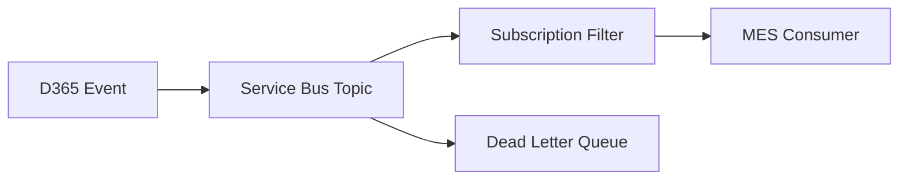

### Custom Business Events and the TSIReadyForMes Flag

Not all production orders in D365 are managed by the MES — only a subset are routed through it. To avoid the MES receiving noise from every production order lifecycle event, two **custom business events** were created rather than using the standard `ProdProductionOrderReleased` event:

| Event | BusinessEventId | Purpose |
|-------|----------------|---------|
| Released to MES | `TSIProductionOrderReleasedToMESBusinessEvent` | Fired when an order is finalised/scheduled and ready for the MES to pick up |
| Order Updated | `TSIProductionOrderUpdatedMESEvent` | Fired when a previously released order is changed (qty, schedule, etc.) and the MES should refresh its data |

**The `TSIReadyForMes` field is the gate.** Both custom events are configured in D365 to fire only when the `TSIReadyForMes` flag on `ProdTable` is set. If an order is not flagged for MES handling, neither event fires and the MES never sees it.

**Data flow on event receipt:**

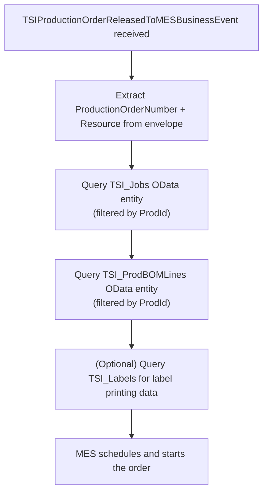

The event payload itself is intentionally minimal (order number + resource). Full order data is always fetched fresh via OData immediately after the event is received. This keeps the events lightweight and ensures the MES always has the latest D365 data.

**D365 date format**: D365 business event payloads encode dates in the legacy format `/Date(milliseconds)/` (e.g. `/Date(1718000000000)/`). `BusinessEventModels.cs` includes a custom `D365DateTimeConverter` that transparently handles this when deserializing event envelopes.

## 🔮 Future Enhancements

Potential improvements:

1. ~~**Business Events Integration**~~ ✅ **COMPLETED**
   - ✅ Subscribe to D365 business events via Service Bus
   - ✅ Real-time notifications to MES
   - ✅ Per-line subscriptions with SQL filters

2. **Batch Processing**
   - Bulk insert/update operations
   - Scheduled synchronization jobs

3. **Enhanced Error Handling**
   - Exponential backoff for transient errors
   - Alerting on dead letter queue growth
   - Automatic replay from DLQ after fixes

4. **Monitoring**
   - Application Insights integration
   - Custom metrics and alerts
   - Service Bus metrics tracking

5. **Caching Layer**
   - Redis for distributed caching
   - Cache master data locally

## 📚 References

- [Azure AD OAuth 2.0](https://learn.microsoft.com/en-us/azure/active-directory/develop/v2-oauth2-client-creds-grant-flow)
- [D365 OData](https://learn.microsoft.com/en-us/dynamics365/fin-ops-core/dev-itpro/data-entities/odata)
- [Inventory Visibility API](https://learn.microsoft.com/en-us/dynamics365/supply-chain/inventory/inventory-visibility-api)
- [MES Integration](https://learn.microsoft.com/en-us/dynamics365/supply-chain/production-control/mes-integration)
- [D365 Business Events](https://learn.microsoft.com/en-us/dynamics365/fin-ops-core/dev-itpro/business-events/home-page)
- [Azure Service Bus](https://learn.microsoft.com/en-us/azure/service-bus-messaging/service-bus-messaging-overview)
