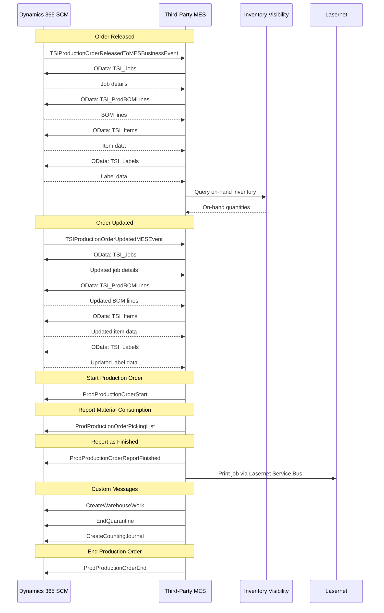

# D365 Integration Samples for Manufacturing Execution Systems

This repository contains C# sample applications demonstrating how to integrate with Microsoft Dynamics 365 Supply Chain Management and the Inventory Visibility Add-in. These samples are designed to help MES vendors integrate with D365 for memory foam bed manufacturing operations.

## 🏗️ Solution Structure

```
D365IntegrationSamples/
├── src/
│   └── D365.Auth/                    # Shared authentication library
│       ├── AzureAdTokenProvider.cs
│       ├── IvaTokenProvider.cs
│       └── D365TokenProvider.cs
├── samples/
│   ├── InventoryVisibility.Samples/     # Inventory Visibility Add-in examples
│   ├── MesIntegration.Samples/          # MES Integration API examples
│   ├── OData.Samples/                   # OData endpoint examples
│   ├── ServiceBusEvents.Samples/        # Azure Service Bus event consumer
│   └── IntegratedEventDriven.Samples/   # Combined Service Bus + OData
└── README.md
```

## 🔄 Integration Flow



## 🔐 Authentication Overview

Both D365 and the Inventory Visibility Add-in use **Azure AD (Microsoft Entra ID)** OAuth 2.0 authentication:

### Inventory Visibility Add-in (Two-Step Process)
1. Acquire Azure AD token
2. Exchange for IVA access token from security service

### D365 Standard APIs (OData & Message Service)
1. Acquire Azure AD token directly

The `D365.Auth` library provides shared authentication components for both scenarios.

## 📦 Projects

### 1. **D365.Auth** (Shared Library)
Common authentication components:
- `AzureAdTokenProvider` - Base Azure AD authentication
- `IvaTokenProvider` - Inventory Visibility Add-in token management
- `D365TokenProvider` - Standard D365 API authentication

### 2. **InventoryVisibility.Samples**
Examples of Inventory Visibility Add-in operations:
- ✅ On-hand inventory queries (read-only for MES)

### 3. **MesIntegration.Samples**
MES Integration API examples:
- ✅ Start production order
- ✅ Report as finished
- ✅ Material consumption (picking lists)
- ✅ End production order

### 4. **OData.Samples**
OData endpoint examples for TSI custom entities and warehouse operations:
- ✅ Query TSI production jobs
- ✅ Retrieve TSI BOM lines
- ✅ Access TSI items and labels
- ✅ Query warehouse work lines
- ✅ Retrieve item batches

### 5. **ServiceBusEvents.Samples**
Azure Service Bus event consumer for D365 business events:
- ✅ Consume TSI production order events (released and updated)
- ✅ Poll once mode (testing) or continuous listening (production)
- ✅ Dead letter queue inspection
- ✅ Automatic retry with DLQ handling

### 6. **IntegratedEventDriven.Samples**
Combined Service Bus + OData integration:
- ✅ Receive TSIProductionOrderReleasedToMESBusinessEvent
- ✅ Extract ProductionOrderNumber and Resource from event
- ✅ Query OData with filtered request for specific order
- ✅ Retrieve BOM lines and related data
- ✅ Demonstrates complete event-driven workflow

## 🚀 Getting Started

### Prerequisites

1. **.NET 8.0 SDK** or later
2. **Azure AD App Registration** with appropriate permissions
3. **D365 Supply Chain Management** environment
4. **Inventory Visibility Add-in** installed and configured

### Configuration

Each sample project uses `appsettings.json` for configuration. Copy `appsettings.Example.json` to `appsettings.json` and fill in your values:

```json
{
  "AzureAd": {
    "TenantId": "your-tenant-id",
    "ClientId": "your-client-id",
    "ClientSecret": "your-client-secret"
  },
  "D365": {
    "EnvironmentId": "your-environment-id",
    "BaseUrl": "https://your-instance.operations.dynamics.com",
    "OrganizationId": "your-legal-entity"
  },
  "InventoryVisibility": {
    "SecurityServiceUrl": "https://securityservice.operations365.dynamics.com",
    "ServiceUrl": "https://inventoryservice.operations365.dynamics.com"
  }
}
```

### Running the Samples

```bash
# Build the solution
dotnet build

# Run Inventory Visibility samples
cd samples/InventoryVisibility.Samples
dotnet run

# Run MES Integration samples
cd samples/MesIntegration.Samples
dotnet run

# Run OData samples
cd samples/OData.Samples
dotnet run

# Run Service Bus event consumer (poll once)
cd samples/ServiceBusEvents.Samples
dotnet run

# Run Service Bus event consumer (continuous mode)
dotnet run -- --continuous

# Check dead letter queue
dotnet run -- --check-dlq

# Run integrated event-driven sample
cd samples/IntegratedEventDriven.Samples
DOTNET_ENVIRONMENT=Development dotnet run
```

## 📚 Documentation

- [MES Integration API Parameters](MES_Integration_API_Parameters.md) - Comprehensive parameter mapping for MES Integration API
- [Inventory Visibility API Documentation](https://learn.microsoft.com/en-us/dynamics365/supply-chain/inventory/inventory-visibility-api)
- [MES Integration Documentation](https://learn.microsoft.com/en-us/dynamics365/supply-chain/production-control/mes-integration)
- [D365 OData Documentation](https://learn.microsoft.com/en-us/dynamics365/fin-ops-core/dev-itpro/data-entities/odata)
- [Business Events Documentation](https://learn.microsoft.com/en-us/dynamics365/fin-ops-core/dev-itpro/business-events/home-page)

## 🏭 Manufacturing Use Cases

These samples demonstrate common scenarios for memory foam bed manufacturing:

1. **Real-time Inventory Tracking** - Query on-hand inventory across production lines
2. **Material Consumption** - Report raw material usage during assembly
3. **Production Reporting** - Track completed units and work-in-progress
4. **Production Order Management** - Start, track, and complete production orders
5. **Reference Data Queries** - Retrieve TSI production jobs, BOM lines, items, and warehouse operations
6. **Event-Driven Integration** - React to D365 production order events via Service Bus
7. **Filtered OData Queries** - Query specific records efficiently using OData filters with event data

## 🛠️ Best Practices

- ✅ Use the shared `D365.Auth` library for all authentication
- ✅ Implement retry logic for transient failures
- ✅ Cache tokens appropriately (respect expiration times)
- ✅ Use structured logging for troubleshooting
- ✅ Handle errors gracefully with meaningful messages
- ✅ Follow async/await patterns for I/O operations
- ✅ Use HttpClientFactory for HTTP requests

## 🤝 Contributing

This is a sample repository for demonstration purposes. Adapt these examples to your specific manufacturing requirements.

## 📄 License

MIT License - See LICENSE file for details

## 🆘 Support

For questions about:
- **D365 APIs**: Contact your D365 implementation partner
- **Inventory Visibility**: Review Microsoft Learn documentation
- **MES Integration**: Consult the MES integration guide

---

**Note**: These samples are provided as-is for educational purposes. Always test thoroughly in a development environment before production use.
